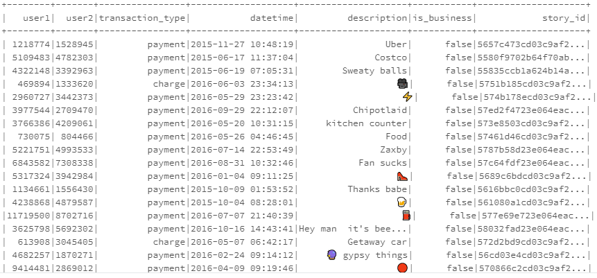

# venmo-spending-behavior

Analyzing user spending behavior on Venmo (Spark MLLib)

--------------------------------

Using user transaction data to predict future transactions.

The data includes:

The approach is multi faceted. First use the the emoji and word classification dictionary([emojipedia](https://emojipedia.org/) to classify user transactions into categories(eg. Food, Travel, Event).

This classification was used to create a spending behavior profile for each user across a period of 12 months of their lifetime.

Secondly, using social netowrk analysis to capture network metrics for each user, like:
1. Number of Friends
2. Number of friends of friends
3. Clustering coefficient ([Clustering Coefficient wiki](https://en.wikipedia.org/wiki/Clustering_coefficient))
4. Page rank ([Eigen centrality and page rank](https://cambridge-intelligence.com/eigencentrality-pagerank/))

Finally using all these metrics to predict future transactions for a user, through a simple Linear regression in Spark.
